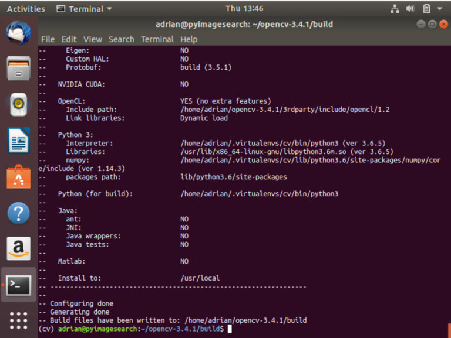

#  OPENCV Install on ubuntu 18.04
##### Check Python Version
    $ python3 --version
    Python 3.6.5
##### Pakage update & upgrade 
    $ sudo apt-get update
    $ sudo apt-get upgrade
    $ sudo apt-get install build-essential cmake unzip pkg-config
    $ sudo apt-get install libjpeg-dev libpng-dev libtiff-dev
    $ sudo apt-get install libavcodec-dev libavformat-dev libswscale-dev libv4l-dev
    $ sudo apt-get install libxvidcore-dev libx264-dev 	
    $ sudo apt-get install libgtk-3-dev
    $ sudo apt-get install libatlas-base-dev gfortran
    $ sudo apt-get install python3-dev
##### Download the official OpenCV source
    $ cd ~
    $ wget -O opencv.zip https://github.com/opencv/opencv/archive/3.4.1.zip
    $ wget -O opencv_contrib.zip https://github.com/opencv/opencv_contrib/archive/3.4.1.zip
    
##### Unzip Opencv
    $ unzip opencv.zip
    $ unzip opencv_contrib.zip      
##### Configure your Python 3 environment    
    $ wget https://bootstrap.pypa.io/get-pip.py
    $ sudo python3 get-pip.py
##### best practice to use virtual environments.
    $ sudo pip install virtualenv virtualenvwrapper
    $ sudo rm -rf ~/get-pip.py ~/.cache/pip
    $ export WORKON_HOME=$HOME/.virtualenvs
    $ export VIRTUALENVWRAPPER_PYTHON=/usr/bin/python3
    $ source /usr/local/bin/virtualenvwrapper.sh
##### append the lines directly via .bashrc file commands    
    $ echo -e "\n# virtualenv and virtualenvwrapper" >> ~/.bashrc
    $ echo "export WORKON_HOME=$HOME/.virtualenvs" >> ~/.bashrc
    $ echo "export VIRTUALENVWRAPPER_PYTHON=/usr/bin/python3" >> ~/.bashrc
    $ echo "source /usr/local/bin/virtualenvwrapper.sh" >> ~/.bashrc
          
##### source the ~/.bashrc  file:     	
    $ source ~/.bashrc   
#####  Creating a virtual environment to hold OpenCV and additional packages    
    $ mkvirtualenv cv -p python3
##### verify that we’re in the cv environment by using the workon command:
    $ workon cv
##### pip install numpy (python3)
    $ pip install numpy
##### Configure and compile OpenCV for Ubuntu 18.04
    $ workon cv
##### Configure OpenCV with CMake
    $ cd ~/opencv-3.4.1/
    $ mkdir build
    $ cd build     
    $ cmake -D CMAKE_BUILD_TYPE=RELEASE \
	-D CMAKE_INSTALL_PREFIX=/usr/local \
	-D INSTALL_PYTHON_EXAMPLES=ON \
	-D INSTALL_C_EXAMPLES=OFF \
	-D OPENCV_EXTRA_MODULES_PATH=~/opencv_contrib-3.4.1/modules \
	-D PYTHON_EXECUTABLE=~/.virtualenvs/cv/bin/python \
	-D BUILD_EXAMPLES=ON ..    
**NOTE here opencv_contrib-3.4.1 will same as download opencv_contrib-3.4.1 you will see about this**  
            
            
##### Compiling OpenCV on Ubuntu 18.04
    $ make -j4
##### Installing and verifying OpenCV
    $ sudo make install
    $ sudo ldconfig
##### Verify the install, sometimes I like to enter the following command in the terminal:
    $ pkg-config --modversion opencv
    3.4.1    
##### Finish your Python+ OpenCV + Ubuntu 18.04 install
    $ ls /usr/local/lib/python3.6/site-packages/
    cv2.cpython-36m-x86_64-linux-gnu.so   
    $ cd /usr/local/lib/python3.6/site-packages/
    $ sudo mv cv2.cpython-36m-x86_64-linux-gnu.so cv2.so
##### OpenCV cv2.so  bindings into our cv  virtual environment:
    $ cd ~/.virtualenvs/cv/lib/python3.6/site-packages/
    $ ln -s /usr/local/lib/python3.6/site-packages/cv2.so cv2.so
##### Testing your OpenCV install on Ubuntu 18.04
    $ cd ~
    $ workon cv
    $ python         
    Python 3.6.5 (default, Apr 1 2018, 05:46:30)
    [GCC 7.3.0] on linux
    Type "help", "copyright", "credits" or "license" for more information.
    >>> import cv2
    >>> cv2.__version__
    '3.4.1'
    >>> quit()
### We are successfully completed installed opencv    

# Issue        
##### Issue on sudo apt-get update
    $ sudo rm -r /etc/apt/sources.list.d
    $ sudo apt-get update
##### Issue on push 
      $ git config --global user.email "borhan.u.cse@gmail.com" 
      $ git config --global user.email "borhan"
      $ git push --set-upstream origin master      